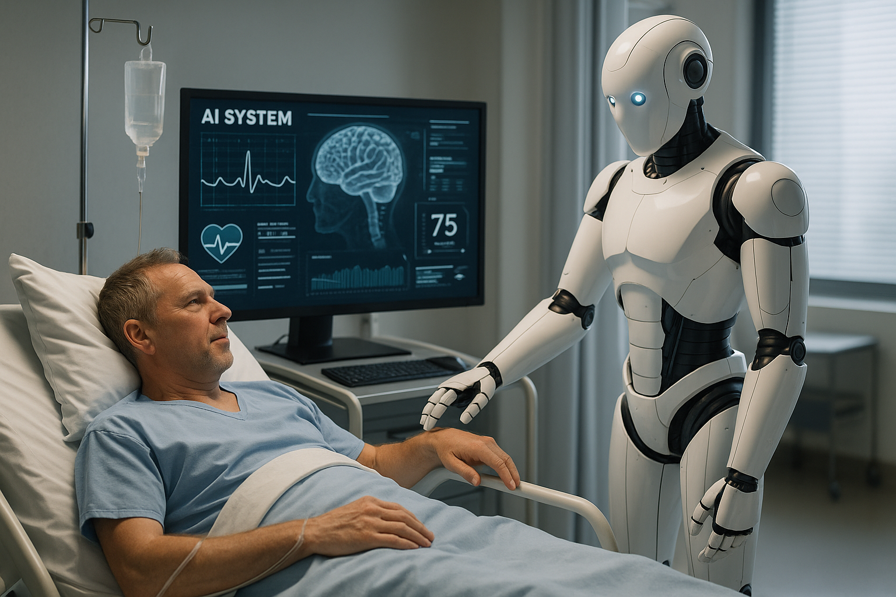

# AI in Healthcare Website

This website was created by **Gurtej Singh** (Student ID: 816467) as part of the **CSCI 101** course project at Columbia College.

It explores how **Artificial Intelligence (AI)** is transforming the healthcare system in Canada, including its benefits, applications, and challenges.

🔗 **Live Website**:  
👉 [https://gurtejsinghgill.github.io/AI-IN-HEALTHCARE/](https://gurtejsinghgill.github.io/AI-IN-HEALTHCARE/)

---

## 🔍 Project Overview

The website covers the following topics:

- Overview of AI in Canadian Healthcare
- Real-world AI Applications
- Benefits and Opportunities
- Challenges and Ethical Concerns
- The Future of AI in Canada

---

## 📸 Website Preview

### Overview Section  


### Applications in Canadian Healthcare  


### Future of AI  


---

## 📁 Repository Structure

```
AI-IN-HEALTHCARE/
│
├── index.html          # Main website code
├── README.md           # Project documentation
└── images/             # Folder with all website images
    ├── overview.png
    ├── canada.png
    └── future.png
```

---

## 🛠️ How to Use

You can open this website live using the GitHub Pages link above or clone the repository and open `index.html` locally in your browser.

---

© Gurtej Singh | Columbia College | CSCI 101 | 2025
